# The Fabric — Autonomous SDLC Agent Team

> **One prompt. A PM coordinator plus 8 specialist agents. A fully built application.**

<p align="center">
  
</p>

Give Claude Code a business objective, and The Fabric coordinates a project manager role plus 8 specialist agents to deliver a working application — with complete documentation, tests, security review, and deployment config.

```
/fabric Build me a task management API with user auth and team workspaces
```

The workflow is designed to run end-to-end from that initial objective.

---

## How It Works

```
                          Business Objective
                                 │
                                 ▼
                    ┌────────────────────────┐
                    │     fabric-pm          │
                    │   Project Manager      │
                    │   (orchestrator)       │
                    └───────────┬────────────┘
                                │
              ┌─────────────────┼─────────────────┐
              ▼                 ▼                 ▼
     ┌─────────────┐  ┌─────────────┐           ...
     │  Phase 1    │  │  Phase 2    │
     │  fabric-ba  │  │  (parallel) │
     │  Business   │  │  ┌────────┐ │
     │  Analyst    │  │  │architect│ │
     └──────┬──────┘  │  ├────────┤ │
            │         │  │  ux    │ │
            ▼         │  └────────┘ │
     Requirements     └──────┬──────┘
     & User Stories          │
                             ▼
                    Architecture, API
                    Contracts, UI Specs
                             │
              ┌──────────────┤
              ▼              ▼
     ┌─────────────┐  ┌─────────────┐
     │  Phase 3    │  │  Phase 4    │
     │  fabric-    │  │  (parallel) │
     │  dev-lead   │  │  ┌────────┐ │
     │  + parallel │  │  │  qa    │ │
     │  sub-agents │  │  ├────────┤ │
     └──────┬──────┘  │  │security│ │
            │         │  └────────┘ │
            ▼         └──────┬──────┘
     Working Code            │
                             ▼
                    Tests + Security
                    Review + Fixes
                    (up to 3 iterations)
                             │
              ┌──────────────┤
              ▼              ▼
     ┌─────────────┐  ┌─────────────┐
     │  Phase 5    │  │  Phase 6    │
     │  fabric-    │  │  fabric-    │
     │  devops     │  │  docs       │
     └──────┬──────┘  └──────┬──────┘
            │                │
            ▼                ▼
     Docker, CI/CD    README, User Guide
     Deploy Config    API Docs
                             │
                             ▼
                    ┌────────────────────┐
                    │   DELIVERED        │
                    │   Working app +    │
                    │   18 doc files +   │
                    │   Full test suite  │
                    └────────────────────┘
```

## The SDLC Phases

| Phase | Agent(s) | What happens | Parallel? |
|:-----:|----------|-------------|:---------:|
| 0 | Project Manager | Charter, workspace setup, team/task creation | |
| 1 | Business Analyst | Requirements + user stories with acceptance criteria | |
| 2 | Architect + UX Engineer | System design, API contracts, wireframes, design system | Yes |
| 3 | Lead Developer | Full implementation with parallel sub-agents per module | |
| 4 | QA + Security Engineer | Unit/integration/e2e tests (Playwright), STRIDE threat model, OWASP review | Yes |
| 4-fix | Lead Developer | Fix critical/high issues, re-test (up to 3 iterations) | |
| 5 | DevOps Engineer | Dockerfile, CI/CD, deployment docs | |
| 6 | Technical Writer | README, user guide, API docs | |
| 7 | Project Manager | Final verification, cleanup, and delivery summary | |

## Testing Coverage

The QA agent produces a comprehensive test suite:

| Test Type | Directory | What's tested |
|-----------|-----------|---------------|
| **Unit** | `tests/unit/` | Core business logic |
| **Integration** | `tests/integration/` | API endpoints |
| **E2E** | `tests/e2e/` | Critical user flows via **Playwright** |
| **Frontend** | `tests/frontend/` | UI components, responsive behavior, form validation |
| **Accessibility** | Included in e2e | WCAG checks via `@axe-core/playwright` |

## Installation

```bash
# Add the marketplace
claude plugin marketplace add mac8005/fabric-sdlc

# Install the plugin
claude plugin install fabric-sdlc
```

### Requirements

- Claude Code with **Agent Teams** enabled (`CLAUDE_CODE_EXPERIMENTAL_AGENT_TEAMS`)
- Recommended: **Claude Opus** for best orchestration results

### Bundled Skills

The plugin bundles 12 permissively licensed design and developer skills. Most are wired into the SDLC phases — the PM instructs the relevant agent to load them — and two are general-purpose extras.

| Skill | What it does | SDLC phase |
|-------|--------------|:----------:|
| `frontend-design` | Distinctive, non-generic UI design | 2, 3 |
| `theme-factory` | 10 pre-built professional themes | 2 |
| `brand-guidelines` | Apply brand colors & typography | 2 |
| `canvas-design` | PNG/PDF diagrams, mockups, visuals | 2 |
| `algorithmic-art` | Generative interactive visuals (p5.js) | 2 |
| `web-artifacts-builder` | Complex React / shadcn/ui artifacts | 3 |
| `claude-api` | Anthropic API / Agent SDK integration | 3 |
| `mcp-builder` | Build MCP servers | 3 |
| `webapp-testing` | Playwright e2e & UI testing | 4 |
| `internal-comms` | Status reports & delivery summaries | 6, 7 |
| `skill-creator` | Author and optimize Claude skills | — |
| `slack-gif-creator` | Slack-optimized animated GIFs | — |

Document export skills for PDF, Word, PowerPoint, and spreadsheets are **not** bundled (licensing). If you have compatible export skills installed separately, Fabric uses them as optional post-processing steps.

## Usage

```bash
# With a business objective
/fabric Build me an invoice API with PDF export and email notifications

# Interactive mode — asks what to build
/fabric
```

## What You Get

After execution, your directory contains a complete project:

```
./
├── docs/                              # 18 core docs (+ 07-tech-debt.md if needed)
│   ├── 00-project-charter.md          #   Business objective and scope
│   ├── 00-progress-log.md             #   Full audit trail of all phases
│   ├── 01-requirements.md             #   Requirements with IDs (REQ-001...)
│   ├── 01-user-stories.md             #   User stories with Given/When/Then
│   ├── 02-architecture.md             #   System design + ADRs
│   ├── 02-tech-stack.md               #   Technology selections + justification
│   ├── 02-api-contracts.md            #   API specs with examples
│   ├── 02b-wireframes.md              #   ASCII wireframes
│   ├── 02b-ui-spec.md                 #   UI component specs
│   ├── 02b-design-system.md           #   Colors, typography, spacing
│   ├── 03-implementation-log.md       #   What was built and why
│   ├── 04-test-plan.md                #   Test strategy
│   ├── 04-test-results.md             #   Pass/fail results by test type
│   ├── 04b-threat-model.md            #   STRIDE threat analysis
│   ├── 04b-security-review.md         #   OWASP top 10 findings
│   ├── 05-deployment.md               #   Deployment guide
│   ├── 06-user-guide.md               #   End-user documentation
│   ├── 06-api-docs.md                 #   API reference
│   └── 07-tech-debt.md                #   Unresolved issues (only if any remain)
├── src/                               # Application source code
├── tests/                             # Comprehensive test suite
│   ├── unit/                          #   Unit tests
│   ├── integration/                   #   Integration tests
│   ├── e2e/                           #   Playwright e2e tests
│   └── frontend/                      #   Frontend component tests
├── infra/                             # Deployment config
│   ├── Dockerfile                     #   Container definition
│   ├── docker-compose.yml             #   Local orchestration
│   └── .github/workflows/            #   CI/CD pipeline
├── README.md                          # Project documentation
└── CLAUDE.md                          # Guidance for future Claude Code sessions
```

## The Team

```
┌──────────────────────────────────────────────────────────────┐
│                    THE FABRIC TEAM                            │
├──────────────┬──────────────┬──────────────┬─────────────────┤
│  fabric-pm   │  fabric-ba   │  fabric-     │  fabric-ux      │
│  Project     │  Business    │  architect   │  UX/UI          │
│  Manager     │  Analyst     │  Solution    │  Engineer        │
│              │              │  Architect   │                  │
├──────────────┼──────────────┼──────────────┼─────────────────┤
│  fabric-     │  fabric-qa   │  fabric-     │  fabric-devops  │
│  dev-lead    │  QA          │  security    │  DevOps         │
│  Lead        │  Engineer    │  Security    │  Engineer        │
│  Developer   │              │  Engineer    │                  │
├──────────────┴──────────────┴──────────────┴─────────────────┤
│  fabric-docs                                                  │
│  Technical Writer                                             │
└──────────────────────────────────────────────────────────────┘
```

## Key Features

- **Fully autonomous** — no human intervention after the initial prompt
- **Full traceability** — every requirement has an ID, traced through design, code, tests, and issues
- **Parallel execution** — architecture + UX run in parallel; QA + security run in parallel
- **Quality gates** — critical/high issues trigger automatic fix-and-retest loops (up to 3 rounds)
- **E2E testing** — Playwright tests for user flows, plus accessibility checks
- **Security-first** — STRIDE threat model + OWASP top 10 code review on every project
- **Production-ready output** — Dockerfile, CI/CD pipelines, deployment docs included

## License

Fabric-specific code is MIT. Bundled third-party skills retain their own license files; see `THIRD_PARTY_NOTICES.md`.
